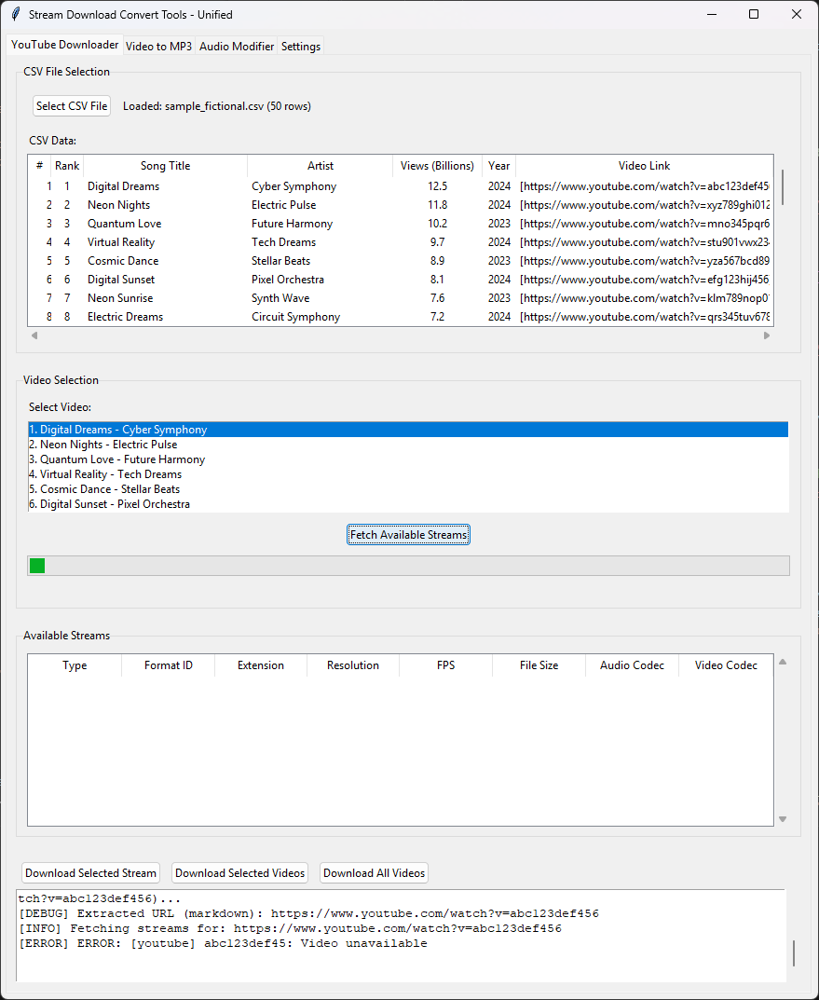

# stream-download-convert-tools

Unified audio and video tools for downloading and processing content from YouTube.

## Features

### Stream Download Convert Tools - Unified Application
A single graphical application with tabbed interface containing three powerful tools:



#### YouTube Downloader Tab
- Load CSV files containing YouTube links
- Command-line support for auto-loading CSV files on startup
- View all available video/audio streams with quality information
- Select specific formats (video+audio, video only, or audio only)
- Customize output filenames using CSV field data
- Real-time download progress with console output display
- Visual progress bar and wait cursor during operations


#### Video to MP3 Converter Tab
- Select multiple video/audio files (MP4, WEBM, M4A, AVI, MOV, MKV, FLV, WMV)
- Batch conversion with progress tracking
- Configurable audio quality (128k, 192k, 256k, 320k)
- Automatic output to converted folder with same basename
- Real-time conversion log
- Uses FFmpeg for high-quality conversion

#### Audio Modifier Tab
- Modify MP3, M4A, WAV, OGG, FLAC files
- Speed adjustment: -50% to +100% (tempo change without pitch change)
- Pitch adjustment: -12 to +12 semitones (change pitch without tempo change)
- Quick preset buttons for common modifications
- Batch processing with progress tracking
- Configurable audio quality (128k, 192k, 256k, 320k)
- Automatic output to converted_changed folder with descriptive suffixes
- Real-time modification log
- Uses FFmpeg for high-quality audio processing

#### Settings Tab
- Configure download folder location
- Customize filename patterns for YouTube downloads
- Centralized settings management

### Key Benefits of Unified Application
- Single application to launch instead of three separate tools
- Seamless workflow between downloading, converting, and modifying
- Shared FFmpeg installation and management
- Consistent user interface across all tools
- Automatic virtual environment management
- Cross-platform support (Windows, Linux, Mac)

## Requirements

- Python 3.7 or higher
- Internet connection for downloading YouTube videos
- FFmpeg (required for video to MP3 conversion)
  - Windows: Automatically downloaded when first needed (no admin rights required)
  - Linux: `sudo apt-get install ffmpeg`
  - Mac: `brew install ffmpeg`

## Installation & Usage

### Windows

1. **Launch Unified Application**: Double-click `launchers/audio_tools_unified.bat`
   - First run will automatically create virtual environment and install dependencies
   - Subsequent runs will launch directly

2. **Auto-load CSV**: Drag and drop a CSV file onto the launcher, or:
   ```cmd
   launchers\audio_tools_unified.bat input\top100.csv
   ```

### Linux/Mac

1. Make the launcher executable (first time only):
   ```bash
   chmod +x launchers/audio_tools_unified.sh
   ```

2. **Basic Launch**:
   ```bash
   ./launchers/audio_tools_unified.sh
   ```

3. **Auto-load CSV**:
   ```bash
   ./launchers/audio_tools_unified.sh input/top100.csv
   ```

### Legacy Individual Tools (Still Available)

The original individual tools are still available for users who prefer separate applications:

**Windows:**
- `launchers/youtube_downloader.bat` - YouTube downloader only
- `launchers/video_to_mp3_converter.bat` - Video to MP3 converter only  
- `launchers/audio_modifier.bat` - Audio modifier only
- `launchers/mp3_to_video_converter.bat` - MP3 to video converter only
- `launchers/video_editor.bat` - Video editor for combining and arranging videos
- `launchers/suno_style_browser.bat` - Suno Style Browser for AI music cover generation

**Linux/Mac:**
- `launchers/youtube_downloader.sh` - YouTube downloader only
- `launchers/video_to_mp3_converter.sh` - Video to MP3 converter only
- `launchers/audio_modifier.sh` - Audio modifier only
- `launchers/mp3_to_video_converter.sh` - MP3 to video converter only
- `launchers/video_editor.sh` - Video editor for combining and arranging videos
- `launchers/suno_style_browser.sh` - Suno Style Browser for AI music cover generation

## How to Use Stream Download Convert Tools - Unified

### YouTube Downloader Tab

1. **Load CSV File**
   - Click "Select CSV File" and choose your CSV file
   - Preview will show the file contents
   - Sample file: `input/top100.csv`

2. **Select Video**
   - Select a video from the list
   - Click "Fetch Available Streams"

3. **Choose Stream**
   - Browse available streams organized by type:
     - Video + Audio: Complete files ready to play
     - Video Only: Video without audio track
     - Audio Only: Audio files (MP3, M4A, etc.)
   - View quality, file size, and codec information
   - Select your preferred stream

4. **Download**
   - Click "Download Selected Stream"
   - Watch the progress bar and wait cursor while downloading
   - Real-time console output appears in the log window
   - Files are saved to the `downloads/` folder

### Video to MP3 Converter Tab

1. **Select Video/Audio Files**
   - Click "Select Video Files"
   - Choose one or more video/audio files (MP4, WEBM, M4A, etc.)
   - Files will appear in the selection list
   - Default folder: `downloads/` (where YouTube videos are saved)

2. **Configure Settings** (Optional)
   - Choose output folder (default: `converted/`)
   - Select audio quality: 128k, 192k, 256k, or 320k
   - Higher quality = larger file size

3. **Convert to MP3**
   - Click "Convert to MP3"
   - Progress bar shows conversion progress
   - Log window displays detailed conversion information
   - Output files saved with same basename as input

### Audio Modifier Tab

1. **Select Audio Files**
   - Click "Select Audio Files"
   - Choose one or more audio files (MP3, M4A, WAV, OGG, FLAC)
   - Files will appear in the selection list
   - Default folder: `converted/` (where MP3 files are saved)

2. **Configure Modifications**
   - **Speed Adjustment**: -50% to +100%
     - Negative values slow down the audio
     - Positive values speed up the audio
     - Changes tempo without affecting pitch
   - **Pitch Adjustment**: -12 to +12 semitones
     - Negative values lower the pitch
     - Positive values raise the pitch
     - 12 semitones = 1 octave
     - Changes pitch without affecting tempo
   - **Audio Quality**: Select 128k, 192k, 256k, or 320k

3. **Use Quick Presets** (Optional)
   - Slower -10%: Reduce speed by 10%
   - Faster +10%: Increase speed by 10%
   - Pitch -1: Lower pitch by 1 semitone
   - Pitch +1: Raise pitch by 1 semitone
   - Reset: Set both to 0 (no change)

4. **Modify Audio Files**
   - Click "Modify Audio Files"
   - Progress bar shows modification progress
   - Log window displays detailed processing information
   - Output files are saved with descriptive suffixes

### Settings Tab

1. **Configure Download Settings**
   - Change download folder location
   - Customize filename pattern using CSV fields:
     - `{Rank}` - Rank number
     - `{Song Title}` - Song title
     - `{Artist}` - Artist name
     - `{Year}` - Year
     - `{Views (Billions)}` - View count
   - Default pattern: `{Rank}_{Song Title}_{Artist}`

## Video Editor (Individual Tool)

A standalone tool for arranging and combining multiple video files:

### Features
- Drag-and-drop video arrangement: Visually arrange videos in a grid by dragging thumbnails
- Video preview: Preview combined videos before saving
- Frame export: Export first or last frame as PNG images
- Video combination: Combine multiple videos into a single output file
- Configurable grid: Adjust number of columns in the video grid
- Project management: Save and load video arrangements as project files
- System player fallback: Automatically falls back to system player when OpenCV GUI is not available
- FFmpeg integration: Uses FFmpeg for video processing and thumbnail generation

### Usage
1. **Add Videos**: Click "Add Videos" button or drag-and-drop video files from Explorer
2. **Arrange Videos**: Drag video thumbnails to reorder them in the grid
3. **Adjust Grid**: Change the number of columns using the "Grid Columns" spinner
4. **Preview**: Click "Preview Combined Video" to preview the result
5. **Export**: Click "Export Combined Video" to save the combined video file
6. **Save Project**: Use File > Save Project to save your arrangement for later

### Supported Formats
- Video: MP4, WEBM, AVI, MOV, MKV, FLV, WMV, M4V
- Output: MP4

### Frame Export
- Export first frame as PNG image
- Export last frame as PNG image  
- Frames are saved in the same folder as the source video

### Project Files
Save your video arrangements as JSON project files:
- Stores video file paths and their order
- Grid column configuration
- Can be loaded later to resume editing

### Requirements
- FFmpeg for video processing (automatically managed)
- Optional: OpenCV for in-app video preview (falls back to system player if not available)

### Use Cases
- Combine multiple short videos into one longer video
- Reorder video clips before uploading
- Extract thumbnails from videos
- Prepare video content for social media
- Create video compilations

## Suno Style Browser (Individual Tool)


A specialized tool for browsing music styles and generating AI-powered content for music covers, album artwork, and video loops.

### Interface Overview

The application features a clean, organized interface with three main sections:

**Top Bar - Search and Filters:**
- **Search**: General search across all style fields
- **Style**: Filter by specific style name
- **Artists**: Filter by sample artists
- **Decade**: Filter by decade range (e.g., "1970s", "1990s")
- **Tempo**: Filter by tempo/BPM
- **Clear Filters**: Reset all filter fields
- **Reload**: Refresh the CSV file (F5)
- **Open CSV**: Load a different CSV file

**Left Panel - Style List (30% width):**
- Scrollable list of all music styles from the loaded CSV
- Click any style to view detailed information
- Styles are sortable by clicking the column header
- Currently selected style is highlighted

**Right Panel - Details and Song Management (70% width):**
- **Style Details Tab**: View complete information about the selected style including mood, tempo, instrumentation, vocal style, sample artists, decade range, production notes, and prompt. Each field has a "Copy" button for easy copying.
- **Song Details Tab**: Complete workflow for creating AI covers:
  - **AI Cover Name**: Generated or manually entered cover name
  - **Song Name**: Original song title
  - **Artist**: Original artist name
  - **Lyrics**: Song lyrics with character counter (20,000 character limit)
  - **Styles**: Input field for style names (comma-separated for multiple)
  - **Merged Style**: AI-generated merged style description
  - **AI Results**: Tabbed interface with:
    - **Album Cover Tab**: Generated album cover prompt with copy button
    - **Video Loop Tab**: Generated video loop prompt with copy button
  - **Album Cover Preview**: Live preview of generated album cover images
  - **Video Options**: Size (720x1280 or 1280x720) and duration (4, 8, or 12 seconds)
  - **Action Buttons**: Two rows of workflow buttons (see Workflow section below)

**Bottom Panel - Debug Output:**
- Collapsible debug panel (Ctrl+D to toggle)
- Comprehensive logging of all operations
- Clear button to reset debug messages
- Shows API calls, responses, errors, and operation status

### Features
- **Advanced Style Browser**: Browse and filter music styles from CSV files with multi-field search and filtering
- **Style Details Viewer**: View complete style information with copyable fields for easy integration
- **AI Cover Name Generation**: Generate creative AI cover names based on song and style information
- **Style Merging**: Combine multiple music styles using AI to create unique merged style descriptions
- **Album Cover Generation**: Generate AI prompts and create album cover images using Azure OpenAI DALL-E 3
- **Video Loop Generation**: Generate AI prompts and create video loops for music visualizers using Azure video generation
- **YouTube Description Export**: Export SEO-optimized YouTube descriptions with hashtags and metadata
- **Song Details Management**: Save and load song details, styles, lyrics, and prompts as JSON files
- **Azure AI Integration**: Configure multiple Azure AI profiles for text, image, and video generation
- **Live Preview**: Preview generated album covers directly in the application interface
- **Debug Output**: Comprehensive debug logging for troubleshooting AI operations
- **Keyboard Shortcuts**: Quick access to common functions

### Workflow

**Row 1 - Setup and Generation:**
1. **Clear All**: Reset all song detail fields
2. **Save**: Save song details to config (Ctrl+S)
3. **Load**: Load song details from JSON file
4. **Merge Styles**: Combine multiple styles using AI
5. **Generate AI Cover Name**: Create cover name from song and style
6. **Gen Album Cover Prompt**: Generate album cover prompt
7. **Gen Video Loop Prompt**: Generate video loop prompt

**Row 2 - Execution and Export:**
1. **Run Album Cover Prompt**: Generate album cover image from prompt
2. **Run Video Loop Prompt**: Generate video loop from prompt
3. **Export YouTube Description**: Export complete YouTube description

### Usage
1. **Browse Styles**: Load a CSV file with music styles and use filters to find the perfect style
2. **Select Style**: Click on a style in the left panel to view detailed information
3. **Enter Song Details**: Fill in song name, artist, lyrics (up to 20,000 characters), and select styles
4. **Merge Styles**: Enter multiple style names and use AI to merge them into a unique description
5. **Generate AI Cover Name**: Create a creative name for your AI cover
6. **Generate Album Cover**: Create an AI prompt, review it, then generate the album cover image
7. **Generate Video Loop**: Create an AI prompt and generate video loop for music visualization
8. **Export YouTube Description**: Export complete YouTube description with SEO optimization

### Configuration
Before using AI features, configure Azure AI settings:
1. Go to **Settings > Azure AI Settings**
2. Configure three profiles:
   - **Text Profile**: For style merging and prompt generation (GPT-4)
   - **Image Gen Profile**: For album cover generation (DALL-E 3)
   - **Video Gen Profile**: For video loop generation (Sora/ImageVideo)
3. Enter your Azure endpoint, deployment name, subscription key, and API version

### Interface Details

**Menu Bar:**
- **Settings**: Access Azure AI Settings dialog with three profile tabs (Text, Image Gen, Video Gen)
- **Help**: Access keyboard shortcuts and about information

**Style Details Tab:**
All style information fields are displayed with copy buttons:
- **Style**: Style name
- **Mood**: Mood description
- **Tempo (BPM)**: Tempo range
- **Instrumentation**: Instrument details
- **Vocal Style**: Vocal characteristics
- **Sample Artists**: Example artists for this style
- **Decade Range**: Time period (e.g., "1970s-1980s")
- **Production Notes**: Production style information
- **Prompt**: Style prompt for AI generation

**Song Details Tab:**
- **Lyrics Field**: Character counter shows current count / 20,000 limit with color coding (gray = normal, orange = approaching limit, red = over limit)
- **AI Results Tabs**: Switch between Album Cover and Video Loop prompts
- **Album Cover Preview**: Displays generated images at up to 512x512 pixels (auto-scaled for large images)
- **Video Options**: Dropdown menus for size and duration selection

### CSV File Format
The tool expects a CSV file with music style information. Default location: `AI/suno/suno_sound_styles.csv`

Example columns:
- `style`: Style name (displayed in left panel list)
- `mood`: Mood description
- `tempo_bpm`: Tempo in BPM (can be range like "120-140")
- `instrumentation`: Instrumentation details
- `vocal_style`: Vocal style description
- `sample_artists`: Example artists (comma-separated)
- `decade_range`: Decade range (e.g., "1970s-1980s")
- `production_notes`: Production style notes
- `prompt`: Style prompt for AI generation

### Keyboard Shortcuts
- **Ctrl+S**: Save song details
- **Ctrl+D**: Toggle debug output
- **Ctrl+F**: Focus search field
- **F5**: Reload CSV file

### Requirements
- Python 3.7 or higher
- Azure OpenAI account with access to:
  - Text generation (GPT-4)
  - Image generation (DALL-E 3)
  - Video generation (Sora/ImageVideo)
- Internet connection for AI API calls

### Use Cases
- Create AI-generated music covers with custom styles
- Generate album artwork for AI music projects
- Create video loops for music visualizers
- Export YouTube descriptions for music content
- Browse and explore music style databases
- Merge multiple music styles for unique compositions

## MP3 to Video Converter (Individual Tool)

A standalone tool for creating videos from MP3 files:

### Features
- Combine MP3 files with images or videos
- Image source: Create videos with static images as background
- Video source: Automatically loop existing videos to match MP3 duration
- Loop modes: Forward only or forward-reverse for seamless looping
- Multiple output qualities: Auto (smart defaults), 480p, 720p, 1080p, Mobile Portrait (9:16), Mobile Landscape (16:9), Instagram Square (1:1), Instagram Story (9:16), Portrait 2:3, Landscape 3:2, Image Size (uses original image dimensions)
- Flexible scaling modes: Stretch, Expand (with black bars), Truncate (crop to fit)
- Batch processing: Convert multiple MP3 files at once
- Configurable video codecs: H.264, H.265, VP9
- Automatic image dimension detection and display
- Settings persistence: Remembers your preferences and file selections between sessions

### Usage
1. **Select MP3 Files**: Choose one or more MP3 files to convert
2. **Choose Video Source**: 
   - **Image**: Select a static image (JPG, PNG, etc.)
   - **Video**: Select a video file to loop (MP4, WEBM, etc.) - video will be repeated to match MP3 length
3. **Configure Settings**:
   - Output folder location
   - Video quality (Auto, 480p, 720p, 1080p, Mobile Portrait, Mobile Landscape, Instagram Square, Instagram Story, Portrait 2:3, Landscape 3:2, Image Size)
   - Video codec (H.264, H.265, VP9)
   - Scaling mode (Stretch, Expand, Truncate)
   - Loop mode (for video sources): Forward only or Forward-Reverse
4. **Convert**: Start the conversion process

### Quality Modes
- **Auto**: Smart defaults - uses image dimensions for image sources, 720p for video sources
- **480p**: Standard definition (854x480)
- **720p**: High definition (1280x720)
- **1080p**: Full high definition (1920x1080)
- **Mobile Portrait (9:16)**: Vertical mobile format (720x1280)
- **Mobile Landscape (16:9)**: Horizontal mobile format (1280x720)
- **Instagram Square (1:1)**: Square format for Instagram posts (1080x1080)
- **Instagram Story (9:16)**: Vertical format for Instagram stories (1080x1920)
- **Portrait 2:3**: Traditional portrait format (720x1080)
- **Landscape 3:2**: Traditional landscape format (1080x720)
- **Image Size**: Uses original image dimensions (only available when image source is selected)

### Scaling Modes
- **Stretch**: Fills the entire frame, may distort aspect ratio
- **Expand**: Fits content within frame, adds black bars (letterbox/pillarbox) to maintain aspect ratio
- **Truncate**: Crops content to fit frame exactly, may cut off parts of the image/video

### Settings Persistence
The application automatically saves your preferences and restores them on startup:
- **Output folder**: Last selected output directory
- **Video quality**: Last selected quality setting
- **Video codec**: Last selected codec
- **Scaling mode**: Last selected scaling method
- **Video source type**: Image or video source preference
- **Loop mode**: Forward or forward-reverse preference
- **File selections**: Last selected image and video files (if they still exist)
- **Image dimensions**: Cached image dimensions for faster loading

Settings are stored in `mp3_to_video_converter_settings.json` in the project root.

### Use Cases
- Create music videos with album artwork
- Generate video content for social media (Instagram, TikTok, YouTube Shorts)
- Convert audio podcasts to video format
- Create visualizers for music tracks
- Mobile-first content creation
- Social media marketing videos

## Recommended Workflow

1. **Download Videos**: Use the YouTube Downloader tab to download videos from CSV lists
2. **Convert to MP3**: Use the Video to MP3 Converter tab to extract audio from downloaded videos
3. **Modify Audio**: Use the Audio Modifier tab to adjust speed and pitch as needed
4. **Create Videos**: Use the MP3 to Video Converter to create videos from MP3 files
5. **Edit Videos**: Use the Video Editor to combine and arrange multiple videos
6. **Generate AI Content**: Use the Suno Style Browser to create AI album covers and video loops for music projects

## FFmpeg Setup (First Time Only)

- **Windows**: If FFmpeg is not found, the app will offer to download it automatically
  - Click "Yes" to download (approximately 80MB, no admin rights needed)
- **Linux/Mac**: Install FFmpeg using the command shown in the prompt:
  - Linux: `sudo apt-get install ffmpeg`
  - Mac: `brew install ffmpeg`

## Examples

### Audio Modification Examples
- **Slow down a song by 10%**: Speed = -10%, Pitch = 0
- **Speed up a song by 20%**: Speed = 20%, Pitch = 0
- **Lower pitch by 1 semitone**: Speed = 0%, Pitch = -1
- **Raise pitch by 2 semitones**: Speed = 0%, Pitch = 2
- **Slow down AND lower pitch**: Speed = -10%, Pitch = -2
- **Speed up AND raise pitch**: Speed = 15%, Pitch = 1

## CSV File Format

Your CSV file should contain YouTube links. The downloader supports:
- Direct URLs: `https://www.youtube.com/watch?v=VIDEO_ID`
- Markdown format: `[https://www.youtube.com/watch?v=VIDEO_ID](https://www.youtube.com/watch?v=VIDEO_ID)`
- Search URLs: `https://www.youtube.com/results?search_query=Artist+-+Song+Title`

Example CSV structure (from `input/top100.csv`):
```csv
"Rank","Song Title","Artist","Views (Billions)","Year","Video Link"
1,"Despacito","Luis Fonsi ft. Daddy Yankee",8.82,2017,"[https://www.youtube.com/watch?v=kJQP7kiw5Fk](https://www.youtube.com/watch?v=kJQP7kiw5Fk)"
```

## Project Structure

```
stream-download-convert-tools/
├── venv/                                # Virtual environment (auto-created)
├── input/                               # Input CSV files
│   └── top100.csv                      # Sample YouTube links
├── downloads/                           # Downloaded videos (auto-created)
├── converted/                           # Converted MP3 files (auto-created)
├── converted_changed/                   # Modified audio files (auto-created)
├── ffmpeg/                              # FFmpeg portable (Windows, auto-downloaded)
├── docs/                                # Documentation and screenshots
│   └── samplestart.png                 # Application screenshot
├── scripts/                             # Python scripts
│   ├── stream_download_convert_tools_unified.py  # Unified application (RECOMMENDED)
│   ├── youtube_downloader.py           # Individual YouTube downloader
│   ├── video_to_mp3_converter.py       # Individual Video to MP3 converter
│   ├── audio_modifier.py               # Individual Audio modifier
│   ├── mp3_to_video_converter.py       # Individual MP3 to Video converter
│   ├── video_editor.py                  # Individual Video Editor
│   └── suno_style_browser.py            # Suno Style Browser for AI music covers
├── launchers/                           # Launcher scripts
│   ├── stream_download_convert_tools_unified.bat  # Windows launcher (Unified - RECOMMENDED)
│   ├── stream_download_convert_tools_unified.sh   # Linux/Mac launcher (Unified - RECOMMENDED)
│   ├── youtube_downloader.bat          # Windows launcher (YouTube only)
│   ├── youtube_downloader.sh           # Linux/Mac launcher (YouTube only)
│   ├── video_to_mp3_converter.bat      # Windows launcher (Converter only)
│   ├── video_to_mp3_converter.sh       # Linux/Mac launcher (Converter only)
│   ├── audio_modifier.bat              # Windows launcher (Audio Modifier only)
│   ├── audio_modifier.sh               # Linux/Mac launcher (Audio Modifier only)
│   ├── mp3_to_video_converter.bat      # Windows launcher (MP3 to Video only)
│   ├── mp3_to_video_converter.sh       # Linux/Mac launcher (MP3 to Video only)
│   ├── video_editor.bat                 # Windows launcher (Video Editor only)
│   ├── video_editor.sh                  # Linux/Mac launcher (Video Editor only)
│   ├── suno_style_browser.bat           # Windows launcher (Suno Style Browser)
│   └── suno_style_browser.sh           # Linux/Mac launcher (Suno Style Browser)
├── requirements.txt                     # Python dependencies
├── .gitignore                           # Git ignore rules
├── AGENTS.md                            # Developer/agent documentation
└── README.md                            # This file
```

## Advanced Features

### Auto-loading CSV Files
You can auto-load a CSV file on startup:
- **Windows**: Drag and drop CSV file onto `audio_tools_unified.bat`
- **Command line**: Pass CSV file path as first argument to launcher
- The GUI will automatically load the CSV and display the video list in the YouTube Downloader tab

### Console Output Integration
All operations show detailed console-style output in the GUI log window:
- `[INFO]` - Informational messages
- `[SUCCESS]` - Successful operations
- `[ERROR]` - Error messages
- Real-time yt-dlp download progress

### Visual Feedback
- **Progress bar**: Animated progress indicator during operations
- **Wait cursor**: Mouse cursor changes to waiting state during busy operations
- **Status messages**: Current operation displayed above progress bar

## Troubleshooting

### Virtual Environment Issues
If you encounter venv problems:
1. Delete the `venv/` folder
2. Re-run the launcher script

### Download Failures
If downloads fail:
1. Check your internet connection
2. Verify the YouTube URL is valid
3. Update yt-dlp: The launcher auto-updates dependencies
4. Some videos may be geo-restricted or require authentication

### Conversion Failures
If MP3 conversion fails:
1. Ensure FFmpeg is installed and in system PATH
2. Check that video files are not corrupted
3. Try a different audio quality setting
4. Verify sufficient disk space in output folder

### GUI Not Showing
Ensure tkinter is installed with Python:
- Windows: Included by default
- Linux: Install with `sudo apt-get install python3-tk`
- Mac: Included by default

### FFmpeg Not Found
**Windows**: The application will offer to download FFmpeg automatically (portable version, no admin rights needed).

**Linux/Mac**: If you get "FFmpeg not found" error:
1. Install FFmpeg using the command shown in the error message
2. Restart the application
3. Test: Open terminal and type `ffmpeg -version`

**Manual Installation (all platforms)**:
1. Download from https://ffmpeg.org/download.html
2. Add to system PATH, or place in `ffmpeg/bin/` folder within the project

## Notes

- All launchers automatically manage virtual environments
- Downloaded files are saved to `downloads/` folder by default
- Converted MP3 files are saved to `converted/` folder by default
- Modified audio files are saved to `converted_changed/` folder by default
- The unified application uses `yt-dlp` for YouTube downloading (actively maintained)
- All processing uses FFmpeg for high-quality audio/video operations
- Filename patterns sanitize special characters automatically
- Original video and audio files are never modified or deleted during processing
- **Recommended**: Use the unified application (`stream_download_convert_tools_unified`) for the best experience
- **Legacy**: Individual tools remain available for users who prefer separate applications

## Legal Disclaimer

This software is provided for educational and personal use only. Users are responsible for:
- Complying with applicable copyright laws in their jurisdiction
- Respecting YouTube's Terms of Service
- Only downloading content they have legal rights to access
- Understanding fair use guidelines for their intended use

**Important**: This tool does not circumvent any digital rights management (DRM) or access controls. Users must ensure their use complies with all applicable laws and platform terms of service.

The authors disclaim any responsibility for misuse of this software.

## License

This project is licensed under the Apache License 2.0 - see the [LICENSE](LICENSE) file for details.

## Contributing

Contributions are welcome! Please feel free to submit a Pull Request. For major changes, please open an issue first to discuss what you would like to change.

## Documentation

- **User Guide**: See [USER_GUIDE.md](USER_GUIDE.md) for comprehensive tutorials and usage instructions
- **Developer Guide**: See `AGENT.md` for detailed development guidelines and project architecture
