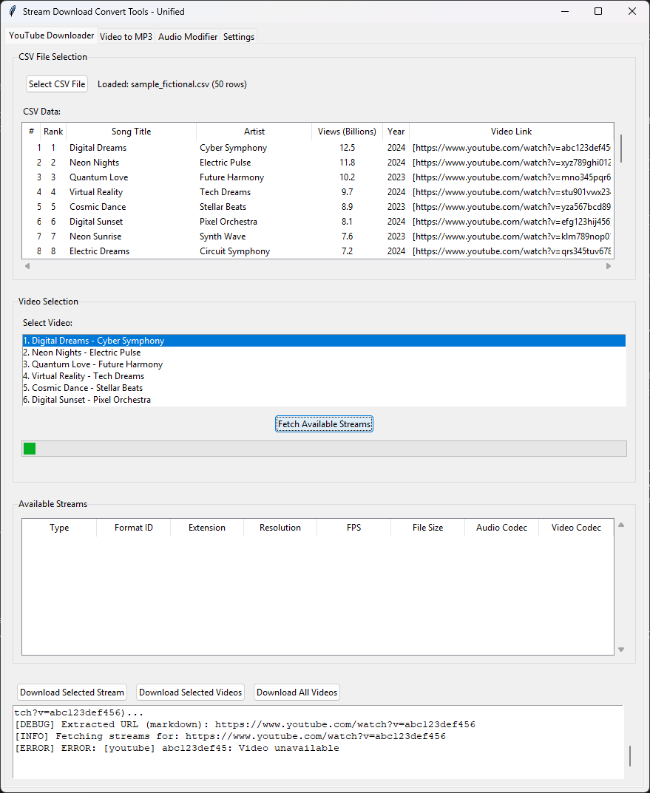
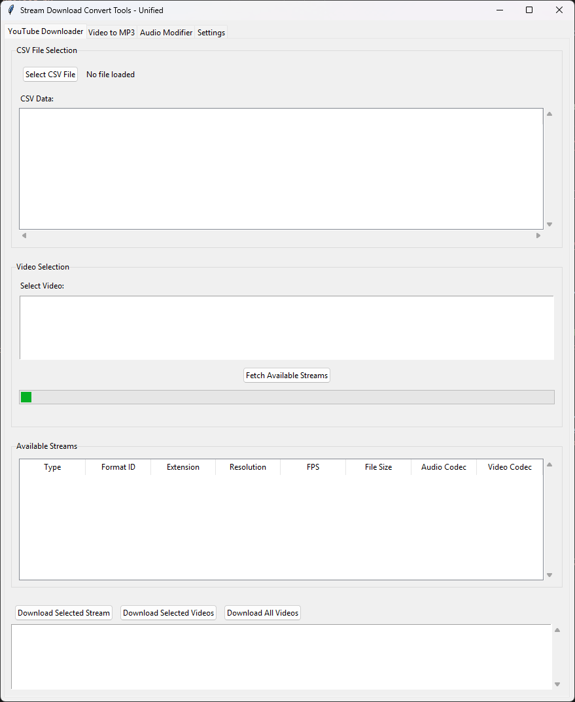

# stream-download-convert-tools

Unified audio and video tools for downloading and processing content from YouTube.

## Features

### Stream Download Convert Tools - Unified Application
A single graphical application with tabbed interface for download and audio processing (video editing is in Video Tools Unified; see below):



#### YouTube Downloader Tab
- Load CSV files containing YouTube links
- Command-line support for auto-loading CSV files on startup
- View all available video/audio streams with quality information
- Select specific formats (video+audio, video only, or audio only)
- Customize output filenames using CSV field data
- Real-time download progress with console output display
- Visual progress bar and wait cursor during operations



#### Audio Modifier Tab
- Modify MP3, M4A, WAV, OGG, FLAC files
- Speed adjustment: -50% to +100% (tempo change without pitch change)
- Pitch adjustment: -12 to +12 semitones (change pitch without tempo change)
- Quick preset buttons for common modifications
- Batch processing with progress tracking
- Configurable audio quality (128k, 192k, 256k, 320k)
- Automatic output to converted_changed folder with descriptive suffixes
- Real-time modification log
- Uses FFmpeg for high-quality audio processing

#### Settings Tab
- Configure download folder location
- Customize filename patterns for YouTube downloads
- Centralized settings management

### Video Tools - Unified Application
Separate launcher: `launchers/video_tools_unified.bat` / `.sh`

Tabs: Video to MP3, Format and Crop, MP3 to Video, Combine Videos, Split and Chunks.

Full guide: [docs/VIDEO_TOOLS_GUIDE.md](docs/VIDEO_TOOLS_GUIDE.md)

### Key Benefits of Unified Application
- Single application for download and audio workflow
- Seamless workflow between downloading, converting, and modifying
- Shared FFmpeg installation and management
- Consistent user interface across all tools
- Automatic virtual environment management
- Cross-platform support (Windows, Linux, Mac)

## Requirements

- Python 3.7 or higher
- Internet connection for downloading YouTube videos
- FFmpeg (required for video to MP3 conversion)
  - Windows: Automatically downloaded when first needed (no admin rights required)
  - Linux: `sudo apt-get install ffmpeg`
  - Mac: `brew install ffmpeg`

## Installation & Usage

### Windows

1. **Launch Unified Application**: Double-click `launchers/audio_tools_unified.bat`
   - First run will automatically create virtual environment and install dependencies
   - Subsequent runs will launch directly

2. **Auto-load CSV**: Drag and drop a CSV file onto the launcher, or:
   ```cmd
   launchers\audio_tools_unified.bat input\top100.csv
   ```

### Linux/Mac

1. Make the launcher executable (first time only):
   ```bash
   chmod +x launchers/audio_tools_unified.sh
   ```

2. **Basic Launch**:
   ```bash
   ./launchers/audio_tools_unified.sh
   ```

3. **Auto-load CSV**:
   ```bash
   ./launchers/audio_tools_unified.sh input/top100.csv
   ```

### Legacy Individual Tools (Still Available)

The original individual tools are still available for users who prefer separate applications:

**Windows:**
- `launchers/youtube_downloader.bat` - YouTube downloader only
- `launchers/video_tools_unified.bat` - All video tools (MP3 extract, format, combine, split)
- `launchers/audio_modifier.bat` - Audio modifier only
- `launchers/suno_style_browser.bat` - Suno Style Browser for AI music cover generation
- `launchers/cover_song_checker.bat` - Cover Song Checker for copyright risk assessment before YouTube upload
- `launchers/song_style_analyzer.bat` - Song Style Analyzer for extracting style information and lyrics from MP3 files
- `launchers/mp3_wav_to_flac_converter.bat` - MP3/WAV to FLAC Converter for lossless audio conversion

**Linux/Mac:**
- `launchers/youtube_downloader.sh` - YouTube downloader only
- `launchers/video_tools_unified.sh` - All video tools (MP3 extract, format, combine, split)
- `launchers/audio_modifier.sh` - Audio modifier only
- `launchers/suno_style_browser.sh` - Suno Style Browser for AI music cover generation
- `launchers/cover_song_checker.sh` - Cover Song Checker for copyright risk assessment before YouTube upload
- `launchers/song_style_analyzer.sh` - Song Style Analyzer for extracting style information and lyrics from MP3 files
- `launchers/mp3_wav_to_flac_converter.sh` - MP3/WAV to FLAC Converter for lossless audio conversion

## How to Use Stream Download Convert Tools - Unified

### YouTube Downloader Tab

1. **Load CSV File**
   - Click "Select CSV File" and choose your CSV file
   - Preview will show the file contents
   - Sample file: `input/top100.csv`

2. **Select Video**
   - Select a video from the list
   - Click "Fetch Available Streams"

3. **Choose Stream**
   - Browse available streams organized by type:
     - Video + Audio: Complete files ready to play
     - Video Only: Video without audio track
     - Audio Only: Audio files (MP3, M4A, etc.)
   - View quality, file size, and codec information
   - Select your preferred stream

4. **Download**
   - Click "Download Selected Stream"
   - Watch the progress bar and wait cursor while downloading
   - Real-time console output appears in the log window
   - Files are saved to the `downloads/` folder

### Audio Modifier Tab

1. **Select Audio Files**
   - Click "Select Audio Files"
   - Choose one or more audio files (MP3, M4A, WAV, OGG, FLAC)
   - Files will appear in the selection list
   - Default folder: `converted/` (where MP3 files are saved)

2. **Configure Modifications**
   - **Speed Adjustment**: -50% to +100%
     - Negative values slow down the audio
     - Positive values speed up the audio
     - Changes tempo without affecting pitch
   - **Pitch Adjustment**: -12 to +12 semitones
     - Negative values lower the pitch
     - Positive values raise the pitch
     - 12 semitones = 1 octave
     - Changes pitch without affecting tempo
   - **Audio Quality**: Select 128k, 192k, 256k, or 320k

3. **Use Quick Presets** (Optional)
   - Slower -10%: Reduce speed by 10%
   - Faster +10%: Increase speed by 10%
   - Pitch -1: Lower pitch by 1 semitone
   - Pitch +1: Raise pitch by 1 semitone
   - Reset: Set both to 0 (no change)

4. **Modify Audio Files**
   - Click "Modify Audio Files"
   - Progress bar shows modification progress
   - Log window displays detailed processing information
   - Output files are saved with descriptive suffixes

### Settings Tab

1. **Configure Download Settings**
   - Change download folder location
   - Customize filename pattern using CSV fields:
     - `{Rank}` - Rank number
     - `{Song Title}` - Song title
     - `{Artist}` - Artist name
     - `{Year}` - Year
     - `{Views (Billions)}` - View count
   - Default pattern: `{Rank}_{Song Title}_{Artist}`

## Video Tools (Unified)

Single application for all video-related tasks. Launch with `launchers/video_tools_unified.bat` (Windows) or `launchers/video_tools_unified.sh` (Linux/Mac).

**Full documentation:** [docs/VIDEO_TOOLS_GUIDE.md](docs/VIDEO_TOOLS_GUIDE.md)

### Tabs

| Tab | Description |
|-----|-------------|
| Video to MP3 | Batch extract MP3 from video files (128k-320k) |
| Format and Crop | Aspect ratio conversion for images/videos; truncate |
| MP3 to Video | MP3 + image or looping video to MP4; social presets |
| Combine Videos | Multi-clip grid, transitions, preview, export, projects |
| Split and Chunks | Fixed-interval splits, single segments, JSON chunk plans |

### Split and Chunks (highlights)

- **Fixed interval:** e.g. 6-second segments for short-form content
- **Single segment:** first/last/middle N seconds or custom start + duration
- **JSON plan:** define multiple segments with `start`, `duration`, `id`, and output naming

Settings: `video_tools_unified_settings.json` (imports legacy per-tool JSON on first run).

## Song Style Analyzer (Individual Tool)

A standalone tool for analyzing MP3 files to extract style information and lyrics for generative audio conditioning. This tool helps reverse-engineer style prompts and lyrics from existing songs for use with generative audio models like Suno V5 and Udio.

### Features

- **Audio Transcription**: Uses Azure Whisper API to transcribe audio and extract lyrics
- **Style Extraction**: AI-powered analysis to extract:
  - Genre classification (primary genre, sub-genre, fusion tags)
  - Mood and valence
  - Instrumentation details
  - Production quality characteristics
  - Suno-style prompts (comma-separated tags)
  - Negative prompts (things to avoid)
- **Grid View**: Results displayed in sortable table with genre, mood, duration, and vocals
- **Detail View**: Double-click any result to see complete analysis with tabs:
  - Summary: All style and technical information
  - Lyrics: Full transcribed lyrics with copy button
  - Full JSON: Complete analysis data structure
- **Drag-and-Drop Support**: Drag MP3 files or folders directly from Explorer/Finder
- **Batch Processing**: Process multiple files or scan directories recursively
- **Copy Functionality**: Copy lyrics and usage suggestions to clipboard
- **Export Options**: Export results to JSON or CSV format
- **Metadata Validation**: Optional requirement for valid artist and song name in MP3 tags

### Usage

1. **Launch**: Double-click `launchers/song_style_analyzer.bat` (Windows) or `launchers/song_style_analyzer.sh` (Linux/Mac)

2. **Configure Azure Settings**:
   - Tool uses same Azure configuration as `suno_persona.py`
   - Requires 'transcribe' profile for audio transcription
   - Requires 'text' profile for style extraction
   - Configure in `scripts/suno_persona_config.json`

3. **Select Files**:
   - Click "Select Single MP3 File" for individual analysis
   - Click "Select Directory (Recursive)" to scan folders
   - Or drag and drop MP3 files/folders onto the file list

4. **Configure Options**:
   - Enable/disable metadata requirement (requires valid artist and song name)
   - Choose output format (JSON or CSV)

5. **Start Analysis**:
   - Click "Start Analysis"
   - Progress bar shows processing status
   - Results appear in grid as they complete
   - Use "Cancel" button to stop processing

6. **View Details**:
   - Double-click any result row to open detail view
   - Copy lyrics or usage suggestions using copy buttons
   - View complete JSON structure

7. **Export Results**:
   - Click "Export Results" to save as JSON or CSV
   - JSON format includes complete analysis structure
   - CSV format includes flattened data for spreadsheet use

### Output Format

Results follow the task specification format with:
- **Input Metadata**: File path, duration, format, artist, title
- **Style Analysis**: Prompt string, genre taxonomy, technical specs
- **Lyric Analysis**: Detected language, vocals presence, structured lyrics
- **Usage Suggestions**: Suno style prompt and negative prompt

### Requirements

- Python 3.7 or higher
- Azure OpenAI account with:
  - Whisper deployment for transcription ('transcribe' profile)
  - Text generation model for style analysis ('text' profile)
- Internet connection for Azure API calls
- MP3 files with valid metadata (optional, can be disabled)

### Use Cases

- Extract style information from existing songs for AI music generation
- Create style prompts for generative audio models (Suno, Udio)
- Analyze song characteristics for music production
- Generate style tags and descriptions from audio files
- Prepare data for AI cover song generation
- Build style databases from music collections

### Important Notes

- Style extraction quality depends on transcription accuracy
- Instrumental tracks may have limited style information
- Technical specs (BPM, key, time signature) are placeholders (would require audio analysis libraries)
- Uses same Azure configuration as `suno_persona.py` - no separate config needed
- Processing time depends on file length and Azure API response times

## MP3/WAV to FLAC Converter (Individual Tool)

A standalone tool for converting MP3 and WAV audio files to FLAC (Free Lossless Audio Codec) format:

### Features
- **Lossless Conversion**: Convert MP3/WAV to high-quality FLAC format
- **High Quality Output**: 44.1 kHz sample rate, stereo, lossless compression
- **Batch Processing**: Convert multiple files at once
- **Drag-and-Drop Support**: Drag files directly from Explorer/Finder
- **Progress Tracking**: Real-time conversion progress and detailed logs
- **Automatic Output**: Files saved in same folder as input with .flac extension

### Usage
1. **Select Files**: Click "Select MP3/WAV Files" or drag-and-drop audio files
2. **Configure Settings** (Optional):
   - Set input folder (default: `converted/` folder)
   - Output format is always FLAC 44.1 kHz (lossless)
3. **Convert**: Click "Convert Selected Files" or "Convert All Files"
4. **Monitor Progress**: Watch progress bar and log output

### Output Format
- **Format**: FLAC (Free Lossless Audio Codec)
- **Sample Rate**: 44.1 kHz
- **Channels**: Stereo (2 channels)
- **Compression Level**: 5 (default, balanced between size and speed)
- **Output Location**: Same folder as input file
- **File Extension**: `.flac`

### Supported Formats
- **Input**: MP3, WAV
- **Output**: FLAC (lossless)

### Use Cases
- Archive audio files in lossless format
- Convert compressed audio to lossless for editing
- Prepare audio files for professional audio work
- Create high-quality audio archives
- Convert downloaded MP3s to lossless format for storage

### Requirements
- Python 3.7 or higher
- FFmpeg for audio conversion (automatically managed on Windows)

### Technical Details
- FLAC compression preserves 100% of audio quality (lossless)
- Smaller file size than WAV while maintaining identical audio quality
- Compatible with all major audio players and editing software
- Compression level 5 provides good balance between file size and encoding speed

## Recommended Workflow

1. **Download Videos**: Use the YouTube Downloader tab to download videos from CSV lists
2. **Video work**: Use Video Tools Unified (`launchers/video_tools_unified.bat`) for MP3 extract, format, combine, split
3. **Modify Audio**: Use the Audio Modifier tab to adjust speed and pitch as needed
4. **Convert to FLAC** (Optional): Use the MP3/WAV to FLAC Converter for lossless archival
5. **Generate AI Content**: Use the Suno Style Browser to create AI album covers and video loops for music projects

## FFmpeg Setup (First Time Only)

- **Windows**: If FFmpeg is not found, the app will offer to download it automatically
  - Click "Yes" to download (approximately 80MB, no admin rights needed)
- **Linux/Mac**: Install FFmpeg using the command shown in the prompt:
  - Linux: `sudo apt-get install ffmpeg`
  - Mac: `brew install ffmpeg`

## Examples

### Audio Modification Examples
- **Slow down a song by 10%**: Speed = -10%, Pitch = 0
- **Speed up a song by 20%**: Speed = 20%, Pitch = 0
- **Lower pitch by 1 semitone**: Speed = 0%, Pitch = -1
- **Raise pitch by 2 semitones**: Speed = 0%, Pitch = 2
- **Slow down AND lower pitch**: Speed = -10%, Pitch = -2
- **Speed up AND raise pitch**: Speed = 15%, Pitch = 1

## CSV File Format

Your CSV file should contain YouTube links. The downloader supports:
- Direct URLs: `https://www.youtube.com/watch?v=VIDEO_ID`
- Markdown format: `[https://www.youtube.com/watch?v=VIDEO_ID](https://www.youtube.com/watch?v=VIDEO_ID)`
- Search URLs: `https://www.youtube.com/results?search_query=Artist+-+Song+Title`

Example CSV structure (from `input/top100.csv`):
```csv
"Rank","Song Title","Artist","Views (Billions)","Year","Video Link"
1,"Despacito","Luis Fonsi ft. Daddy Yankee",8.82,2017,"[https://www.youtube.com/watch?v=kJQP7kiw5Fk](https://www.youtube.com/watch?v=kJQP7kiw5Fk)"
```

## Project Structure

```
stream-download-convert-tools/
├── venv/                                # Virtual environment (auto-created)
├── input/                               # Input CSV files
│   └── top100.csv                      # Sample YouTube links
├── downloads/                           # Downloaded videos (auto-created)
├── converted/                           # Converted MP3 files (auto-created)
├── converted_changed/                   # Modified audio files (auto-created)
├── ffmpeg/                              # FFmpeg portable (Windows, auto-downloaded)
├── docs/                                # Documentation and screenshots
│   └── samplestart.png                 # Application screenshot
├── scripts/                             # Python scripts
│   ├── stream_download_convert_tools_unified.py  # Unified application (RECOMMENDED)
│   ├── youtube_downloader.py           # Individual YouTube downloader
│   ├── video_tools_unified.py          # Unified video tools (recommended)
│   ├── video_tabs/                     # Tab modules for video tools
│   ├── audio_modifier.py               # Individual Audio modifier
│   ├── suno_style_browser.py            # Suno Style Browser for AI music covers
│   ├── cover_song_checker.py            # Cover Song Checker for copyright risk assessment
│   ├── song_style_analyzer.py          # Song Style Analyzer for generative conditioning
│   └── mp3_wav_to_flac_converter.py    # MP3/WAV to FLAC Converter
├── launchers/                           # Launcher scripts
│   ├── stream_download_convert_tools_unified.bat  # Windows launcher (Unified - RECOMMENDED)
│   ├── stream_download_convert_tools_unified.sh   # Linux/Mac launcher (Unified - RECOMMENDED)
│   ├── youtube_downloader.bat          # Windows launcher (YouTube only)
│   ├── youtube_downloader.sh           # Linux/Mac launcher (YouTube only)
│   ├── video_tools_unified.bat         # Windows launcher (Video tools - RECOMMENDED)
│   ├── video_tools_unified.sh          # Linux/Mac launcher (Video tools)
│   ├── audio_modifier.bat              # Windows launcher (Audio Modifier only)
│   ├── audio_modifier.sh               # Linux/Mac launcher (Audio Modifier only)
│   ├── suno_style_browser.bat           # Windows launcher (Suno Style Browser)
│   ├── suno_style_browser.sh           # Linux/Mac launcher (Suno Style Browser)
│   ├── cover_song_checker.bat          # Windows launcher (Cover Song Checker)
│   ├── cover_song_checker.sh            # Linux/Mac launcher (Cover Song Checker)
│   ├── song_style_analyzer.bat         # Windows launcher (Song Style Analyzer)
│   ├── song_style_analyzer.sh           # Linux/Mac launcher (Song Style Analyzer)
│   ├── mp3_wav_to_flac_converter.bat    # Windows launcher (MP3/WAV to FLAC Converter)
│   └── mp3_wav_to_flac_converter.sh     # Linux/Mac launcher (MP3/WAV to FLAC Converter)
├── requirements.txt                     # Python dependencies
├── .gitignore                           # Git ignore rules
├── AGENTS.md                            # Developer/agent documentation
└── README.md                            # This file
```

## Advanced Features

### Auto-loading CSV Files
You can auto-load a CSV file on startup:
- **Windows**: Drag and drop CSV file onto `audio_tools_unified.bat`
- **Command line**: Pass CSV file path as first argument to launcher
- The GUI will automatically load the CSV and display the video list in the YouTube Downloader tab

### Console Output Integration
All operations show detailed console-style output in the GUI log window:
- `[INFO]` - Informational messages
- `[SUCCESS]` - Successful operations
- `[ERROR]` - Error messages
- Real-time yt-dlp download progress

### Visual Feedback
- **Progress bar**: Animated progress indicator during operations
- **Wait cursor**: Mouse cursor changes to waiting state during busy operations
- **Status messages**: Current operation displayed above progress bar

## Troubleshooting

### Virtual Environment Issues
If you encounter venv problems:
1. Delete the `venv/` folder
2. Re-run the launcher script

### Download Failures
If downloads fail:
1. Check your internet connection
2. Verify the YouTube URL is valid
3. Update yt-dlp: The launcher auto-updates dependencies
4. Some videos may be geo-restricted or require authentication

### Conversion Failures
If MP3 conversion fails:
1. Ensure FFmpeg is installed and in system PATH
2. Check that video files are not corrupted
3. Try a different audio quality setting
4. Verify sufficient disk space in output folder

### GUI Not Showing
Ensure tkinter is installed with Python:
- Windows: Included by default
- Linux: Install with `sudo apt-get install python3-tk`
- Mac: Included by default

### FFmpeg Not Found
**Windows**: The application will offer to download FFmpeg automatically (portable version, no admin rights needed).

**Linux/Mac**: If you get "FFmpeg not found" error:
1. Install FFmpeg using the command shown in the error message
2. Restart the application
3. Test: Open terminal and type `ffmpeg -version`

**Manual Installation (all platforms)**:
1. Download from https://ffmpeg.org/download.html
2. Add to system PATH, or place in `ffmpeg/bin/` folder within the project

## Notes

- All launchers automatically manage virtual environments
- Downloaded files are saved to `downloads/` folder by default
- Converted MP3 files are saved to `converted/` folder by default
- Modified audio files are saved to `converted_changed/` folder by default
- The unified application uses `yt-dlp` for YouTube downloading (actively maintained)
- All processing uses FFmpeg for high-quality audio/video operations
- Filename patterns sanitize special characters automatically
- Original video and audio files are never modified or deleted during processing
- **Recommended**: Use the unified application (`stream_download_convert_tools_unified`) for the best experience
- **Legacy**: Individual tools remain available for users who prefer separate applications

## Legal Disclaimer

This software is provided for educational and personal use only. Users are responsible for:
- Complying with applicable copyright laws in their jurisdiction
- Respecting YouTube's Terms of Service
- Only downloading content they have legal rights to access
- Understanding fair use guidelines for their intended use

**Important**: This tool does not circumvent any digital rights management (DRM) or access controls. Users must ensure their use complies with all applicable laws and platform terms of service.

The authors disclaim any responsibility for misuse of this software.

## License

This project is licensed under the Apache License 2.0 - see the [LICENSE](LICENSE) file for details.

## Contributing

Contributions are welcome! Please feel free to submit a Pull Request. For major changes, please open an issue first to discuss what you would like to change.

## Documentation

- **User Guide**: See [USER_GUIDE.md](USER_GUIDE.md) for comprehensive tutorials and usage instructions
- **Video Tools**: See [docs/VIDEO_TOOLS_GUIDE.md](docs/VIDEO_TOOLS_GUIDE.md) for video unified app and chunk JSON reference
- **Developer Guide**: See `AGENT.md` for detailed development guidelines and project architecture
