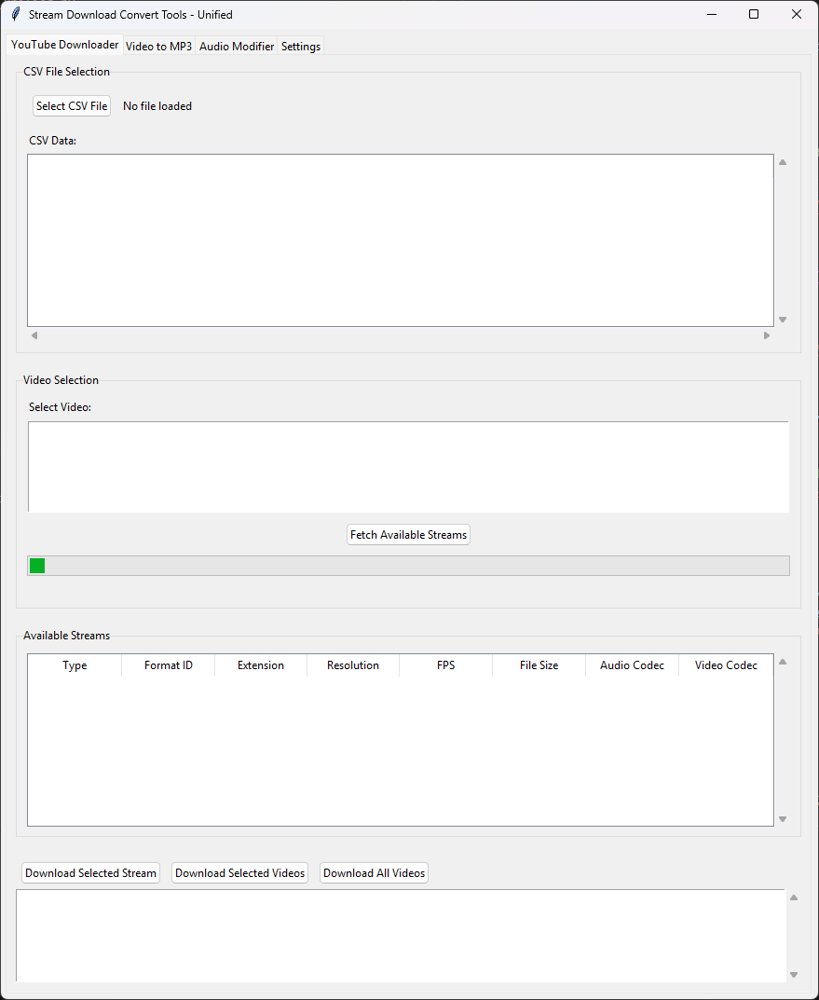
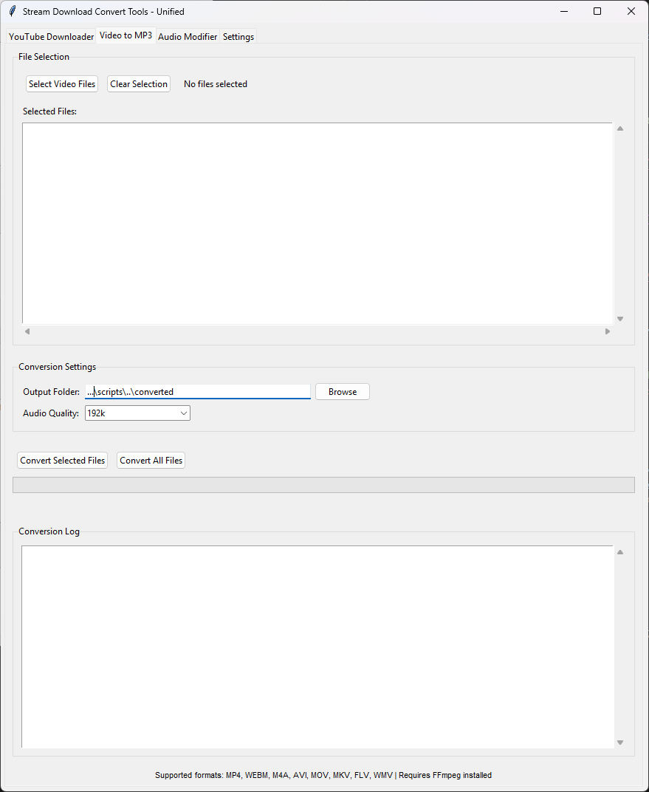
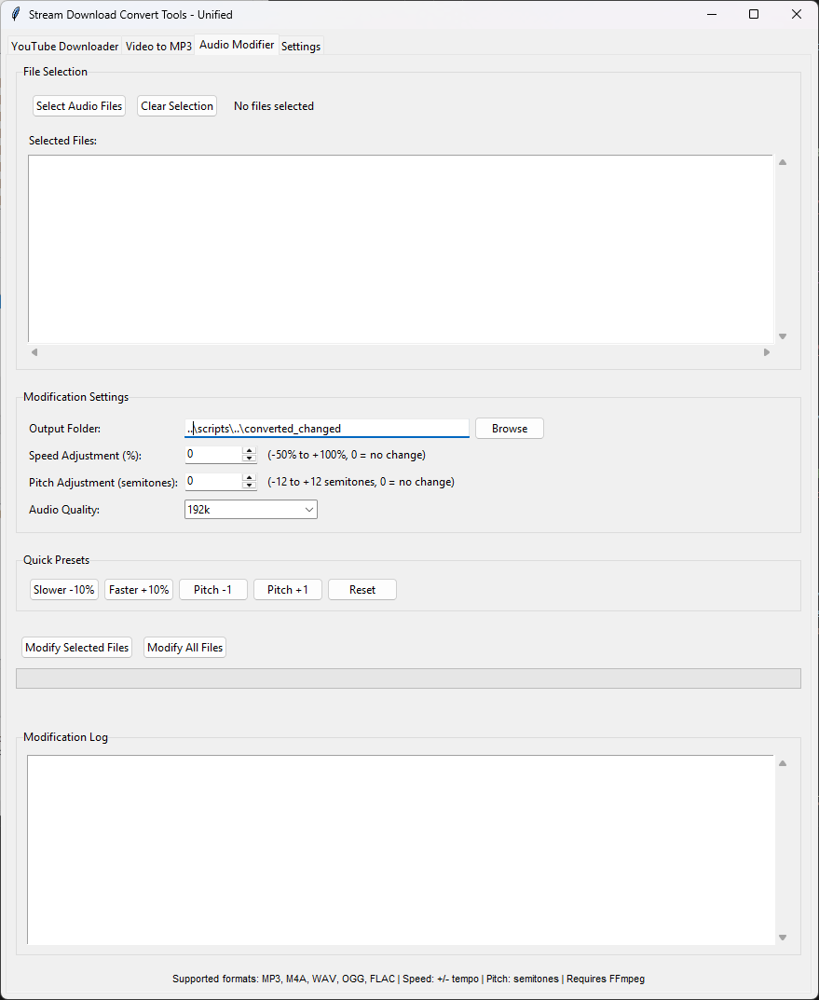
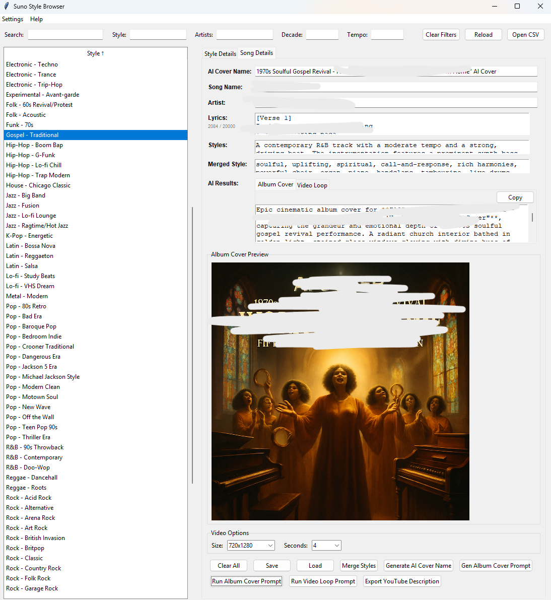
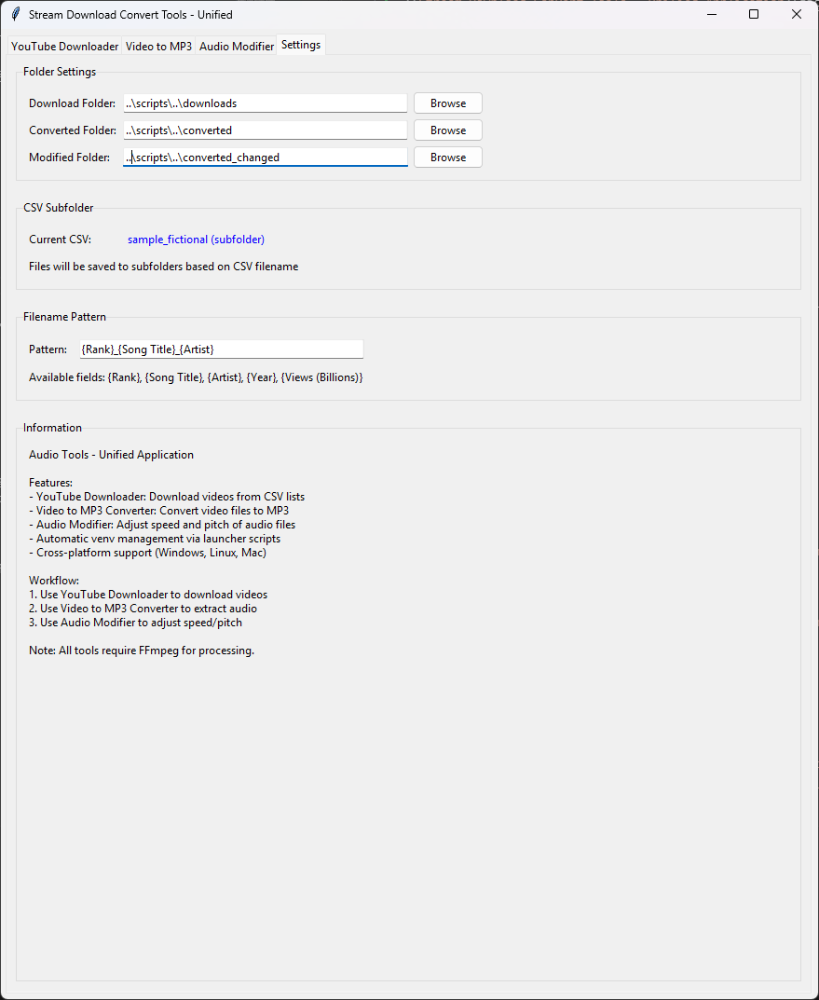

# Stream Download Convert Tools - Complete User Guide

Welcome to Stream Download Convert Tools! This comprehensive guide will help you get the most out of your audio and video processing workflow.


## Table of Contents

1. [Getting Started](#getting-started)
2. [YouTube Downloader](#youtube-downloader)
3. [Video to MP3 Converter](#video-to-mp3-converter)
4. [Audio Modifier](#audio-modifier)
5. [Cover Song Checker](#cover-song-checker)
6. [Suno Style Browser](#suno-style-browser)
7. [Settings Configuration](#settings-configuration)
8. [Troubleshooting](#troubleshooting)
9. [Advanced Features](#advanced-features)
10. [Legal and Compliance](#legal-and-compliance)

## Getting Started

### First Launch

When you first launch Stream Download Convert Tools, you'll see a legal disclaimer. Please read it carefully and click "I Accept" to continue. This ensures you understand your responsibilities when using the software.

### System Requirements

- **Python 3.7 or higher**
- **Internet connection** (for YouTube downloads)
- **FFmpeg** (automatically downloaded on Windows)
- **Sufficient disk space** (depends on your downloads)

### Launching the Application

**Windows:**
- Double-click `launchers/stream_download_convert_tools_unified.bat`
- First run will create a virtual environment and install dependencies

**Linux/Mac:**
- Make executable: `chmod +x launchers/stream_download_convert_tools_unified.sh`
- Run: `./launchers/stream_download_convert_tools_unified.sh`

### Auto-loading CSV Files

You can automatically load a CSV file on startup:

**Windows:**
- Drag and drop a CSV file onto `stream_download_convert_tools_unified.bat`
- Or use command line: `launchers\stream_download_convert_tools_unified.bat input\top100.csv`

**Linux/Mac:**
- Command line: `./launchers/stream_download_convert_tools_unified.sh input/top100.csv`

## YouTube Downloader



### Step 1: Prepare Your CSV File

Your CSV file should contain YouTube links. Supported formats:

**Direct YouTube URLs:**
```csv
Rank,Song Title,Artist,Year,Video Link
1,Despacito,Luis Fonsi ft. Daddy Yankee,2017,https://www.youtube.com/watch?v=kJQP7kiw5Fk
```

**Markdown Format:**
```csv
Rank,Song Title,Artist,Year,Video Link
1,Despacito,Luis Fonsi ft. Daddy Yankee,2017,[https://www.youtube.com/watch?v=kJQP7kiw5Fk](https://www.youtube.com/watch?v=kJQP7kiw5Fk)
```

**YouTube Search URLs:**
```csv
Rank,Song Title,Artist,Year,Video Link
1,Bridge Over Troubled Water,Simon & Garfunkel,1970,https://www.youtube.com/results?search_query=Simon+%26+Garfunkel+-+Bridge+Over+Troubled+Water
```

### Step 2: Load Your CSV File

1. Click "Select CSV File" in the YouTube Downloader tab
2. Choose your CSV file
3. Preview will show the file contents
4. The video list will populate automatically

### Step 3: Select a Video

1. Click on a video in the list
2. Click "Fetch Available Streams"
3. Wait for the stream information to load

### Step 4: Choose Your Stream

Streams are organized by type:

**Video + Audio (Recommended):**
- Complete files ready to play
- Best quality options
- Larger file sizes

**Video Only:**
- Video without audio track
- Useful for video editing
- Requires separate audio download

**Audio Only:**
- Audio files (MP3, M4A, etc.)
- Smaller file sizes
- Perfect for music

### Step 5: Download

**Single Download:**
1. Select your preferred stream
2. Click "Download Selected Stream"
3. Watch the progress bar and log output
4. Use "Cancel Download" button to stop if needed

**Batch Downloads:**
1. Select multiple videos (Ctrl+Click)
2. Choose "Download Selected Videos" or "Download All Videos"
3. All videos will use the same format
4. Use "Cancel Download" button to stop batch downloads

**Download Organization:**
- Downloads are automatically organized by CSV filename
- Example: If CSV is `top100_songs.csv`, files go to `downloads/top100_songs/`
- This keeps downloads from different CSV files separate

### Download Tips

- **Quality vs Size**: Higher quality = larger files
- **Format Selection**: MP4 is most compatible, WEBM is more efficient
- **Network**: Stable internet connection recommended
- **Storage**: Check available disk space before large downloads
- **Canceling**: You can cancel downloads at any time using the Cancel button

## Video to MP3 Converter



### Step 1: Select Video Files

1. Click "Select Video Files" in the Video to MP3 tab
2. Choose one or more video files
3. Supported formats: MP4, WEBM, M4A, AVI, MOV, MKV, FLV, WMV
4. Default folder: `downloads/` (where YouTube videos are saved)

### Step 2: Configure Settings

**Output Folder:**
- Default: `converted/`
- Click "Browse" to change location

**Audio Quality:**
- **128k**: Smallest files, basic quality
- **192k**: Good balance (recommended)
- **256k**: High quality
- **320k**: Maximum quality, largest files

### Step 3: Convert

1. Click "Convert to MP3"
2. Watch the progress bar
3. Monitor the log for detailed information
4. Files are saved with the same basename as input

### Conversion Tips

- **Batch Processing**: Select multiple files for efficiency
- **Quality Settings**: 192k is usually sufficient for most uses
- **File Organization**: Use descriptive folder names
- **Backup**: Original files are never modified

## Audio Modifier



### Step 1: Select Audio Files

1. Click "Select Audio Files" in the Audio Modifier tab
2. Choose audio files: MP3, M4A, WAV, OGG, FLAC
3. Default folder: `converted/` (where MP3 files are saved)

### Step 2: Configure Modifications

**Speed Adjustment:**
- Range: -50% to +100%
- Negative values slow down audio
- Positive values speed up audio
- Changes tempo without affecting pitch

**Pitch Adjustment:**
- Range: -12 to +12 semitones
- Negative values lower pitch
- Positive values raise pitch
- 12 semitones = 1 octave
- Changes pitch without affecting tempo

**Audio Quality:**
- Same options as converter: 128k, 192k, 256k, 320k

### Step 3: Use Quick Presets

**Common Presets:**
- **Slower -10%**: Reduce speed by 10%
- **Faster +10%**: Increase speed by 10%
- **Pitch -1**: Lower pitch by 1 semitone
- **Pitch +1**: Raise pitch by 1 semitone
- **Reset**: Set both to 0 (no change)

### Step 4: Modify Audio

1. Click "Modify Audio Files"
2. Watch the progress bar
3. Monitor the log for processing details
4. Output files are saved with descriptive suffixes

### Modification Tips

- **Combined Effects**: You can adjust both speed and pitch
- **Quality Preservation**: Higher quality settings preserve audio fidelity
- **Testing**: Try small adjustments first
- **Backup**: Original files are never modified

## Cover Song Checker

The Cover Song Checker helps you assess copyright risk before uploading cover songs to YouTube by analyzing existing cover video history.

### Overview

Before uploading a cover song to YouTube, it's important to understand the potential copyright risks. This tool analyzes existing cover videos on YouTube to provide risk indicators based on:
- Number of existing covers
- Age of oldest cover videos
- Known problematic artists/publishers
- Cover video statistics

**Important**: This tool provides risk indicators only, not a 100% guarantee. Claims can come weeks or months after upload, even for heavily modified AI covers.

### Launching Cover Song Checker

**Windows:**
- Double-click `launchers/cover_song_checker.bat`

**Linux/Mac:**
- Make executable: `chmod +x launchers/cover_song_checker.sh`
- Run: `./launchers/cover_song_checker.sh`

### Checking a Single Song

1. **Enter Song Information**:
   - Type the song title in "Song Title" field
   - Type the artist name in "Artist" field (optional but recommended)

2. **Start Analysis**:
   - Click "Check Song"
   - The tool will search YouTube for existing cover videos
   - Progress is shown in the log area

3. **View Results**:
   - Results appear in the table above the log
   - Shows: Cover Count, Claims %, Strikes %, Oldest Age, Avg Views, Risk Level, Recommendation

4. **View Details**:
   - Double-click any result to see all found cover videos
   - View video titles, URLs, views, duration, and upload dates
   - Click "Open Selected Video in Browser" to view on YouTube

### Batch Processing

#### Option 1: Load from CSV

1. Click "Load CSV"
2. Select a CSV file with song data
3. Tool will extract Song Title and Artist columns
4. Confirm to start batch analysis

#### Option 2: Select from AI-COVERS

1. Click "Select from AI-COVERS"
2. Dialog opens showing all songs organized by decade
3. Select individual songs (use Ctrl/Cmd for multiple)
4. Click "Analyze Selected" to start analysis

#### Option 3: Scan All AI-COVERS

1. Click "Scan All AI-COVERS"
2. Tool automatically scans all songs in AI/AI-COVERS directory
3. Confirm to start batch analysis for all songs

### Understanding Risk Levels

**GRUEN (Low Risk - Green)**:
- Many existing covers (>20) without strikes
- Covers have existed for months or years
- Lower probability of receiving a strike

**GELB (Medium Risk - Yellow)**:
- Moderate cover history (10-20 covers)
- Some caution advised
- May want to check manually or use unlisted test upload

**ROT (High Risk - Red)**:
- Few or no existing covers (<10)
- Known problematic artists (Eminem, Drake, etc.)
- Known problematic publishers (Universal, Sony, etc.)
- Very recent songs (<2 years old)
- Higher probability of receiving a strike

### Using Results

**Copy Song Information**:
- Right-click on any result
- Choose "Copy Song Title", "Copy Artist", or "Copy: Song Title - Artist"
- Text is copied to clipboard

**Export Results**:
- Click "Export Results to CSV"
- Save all results to a CSV file for further analysis

**View Cover Videos**:
- Double-click any result
- See all found cover videos with details
- Open videos directly in browser

### Important Limitations

- **No Guarantee**: Tool provides risk indicators based on history, not absolute guarantees
- **Delayed Claims**: Claims can come weeks or months after upload (real-world experience: 2 months delay)
- **Stylistic Changes**: Even heavily modified AI covers can be detected and receive strikes
- **No Actual Claim Detection**: Cannot detect actual Content ID claims/strikes without YouTube Data API v3
- **New Songs**: Songs with no cover history cannot be assessed

### Best Practices

1. **Check Before Upload**: Always check risk level before uploading
2. **GRUEN**: Generally safer, but still monitor after upload
3. **GELB**: Consider unlisted test upload and monitor for 2-3 months
4. **ROT**: Strongly consider obtaining proper licenses or not uploading
5. **Monitor After Upload**: Even "safe" songs can receive delayed claims

### Real-World Example

**Case**: AI covers with heavily modified styles (1970s Soulful Urban Blues version of "Love The Way You Lie")
- Upload: November 10, 2025
- Initial Check: No detection at upload
- Result: Copyright Strike received December 21, 2025 (almost 2 months later)
- Publisher: Universal Music Publishing Group (UMPG)
- Lesson: Even heavily modified covers can be detected, claims can come months later

## Suno Style Browser



The Suno Style Browser is a specialized tool for browsing music styles and generating AI-powered content for music covers, including album artwork and video loops. The interface is divided into three main sections: style browser (left), details and song management (right), and debug output (bottom).

### Interface Layout

**Top Search and Filter Bar:**
The top bar contains search and filter controls for quickly finding styles:
- **Search**: Searches across all style fields (style name, mood, artists, etc.)
- **Style**: Filter by specific style name
- **Artists**: Filter by sample artists mentioned in styles
- **Decade**: Filter by decade range (e.g., type "1970s" or "1990s")
- **Tempo**: Filter by tempo/BPM values
- **Clear Filters**: Resets all filter fields at once
- **Reload**: Refreshes the CSV file (also F5 keyboard shortcut)
- **Open CSV**: Opens file dialog to load a different CSV file

**Left Panel - Style List:**
- Displays all music styles from the loaded CSV file
- Click any style to select it and view details
- Click the "Style" column header to sort (ascending/descending)
- Currently selected style is highlighted in blue
- Scrollable list for large style databases

**Right Panel - Details Tabs:**
The right panel contains two main tabs:

**Style Details Tab:**
- Shows complete information about the selected style
- All fields are read-only and have "Copy" buttons for easy copying
- Fields include: Style, Mood, Tempo (BPM), Instrumentation, Vocal Style, Sample Artists, Decade Range, Production Notes, and Prompt
- Scrollable interface for long content

**Song Details Tab:**
- **AI Cover Name**: Text field for the generated cover name
- **Song Name**: Original song title
- **Artist**: Original artist name
- **Lyrics**: Multi-line text area with character counter (20,000 character limit)
  - Counter shows "X / 20000" format
  - Color changes: gray (normal), orange (approaching limit), red (over limit)
- **Styles**: Multi-line field for entering style names (comma-separated for multiple)
- **Merged Style**: Result field showing AI-merged style description
- **AI Results**: Tabbed interface containing:
  - **Album Cover Tab**: Generated album cover prompt with toolbar and copy button
  - **Video Loop Tab**: Generated video loop prompt with toolbar and copy button
- **Album Cover Preview**: Image preview area showing generated album covers
  - Displays "No image generated yet" when empty
  - Auto-scales large images to fit (max 512x512 display size)
- **Video Options**: Configuration panel with:
  - **Size**: Dropdown with "720x1280" (portrait) or "1280x720" (landscape)
  - **Seconds**: Dropdown with "4", "8", or "12" seconds
- **Action Buttons**: Two rows of workflow buttons (see detailed workflow below)

**Bottom Panel - Debug Output:**
- Collapsible panel (click "▼ Debug Output" or press Ctrl+D)
- Shows comprehensive logging of all operations
- Timestamped messages with log levels (INFO, DEBUG, ERROR, WARNING)
- "Clear" button to reset debug messages
- Useful for troubleshooting API calls and configuration issues

### Getting Started with Suno Style Browser

**Windows:**
- Double-click `launchers/suno_style_browser.bat`
- First run will create a virtual environment and install dependencies

**Linux/Mac:**
- Make executable: `chmod +x launchers/suno_style_browser.sh`
- Run: `./launchers/suno_style_browser.sh`

**Auto-load CSV:**
- Command line: `launchers\suno_style_browser.bat AI\suno\suno_sound_styles.csv` (Windows)
- Command line: `./launchers/suno_style_browser.sh AI/suno/suno_sound_styles.csv` (Linux/Mac)

### Step 1: Configure Azure AI Settings

Before using AI features, you need to configure Azure AI access:

1. Go to **Settings > Azure AI Settings**
2. Configure three profiles:

**Text Profile (for style merging and prompts):**
- Endpoint: Your Azure OpenAI endpoint
- Model Name: gpt-4
- Deployment: Your GPT-4 deployment name
- Subscription Key: Your Azure API key
- API Version: 2024-12-01-preview

**Image Gen Profile (for album covers):**
- Endpoint: Your Azure OpenAI endpoint
- Model Name: dall-e-3
- Deployment: Your DALL-E 3 deployment name
- Subscription Key: Your Azure API key
- API Version: 2024-02-15-preview

**Video Gen Profile (for video loops):**
- Endpoint: Your Azure OpenAI endpoint
- Model Name: imagevideo (or sora-2)
- Deployment: Your video generation deployment name
- Subscription Key: Your Azure API key
- API Version: 2024-02-15-preview

### Step 2: Browse Music Styles

1. **Load CSV File**: The tool automatically loads `AI/suno/suno_sound_styles.csv` by default
   - The status bar at the bottom shows "Loaded X styles from [path]"
   - Use "Open CSV" button to load a different file

2. **Use Filters**: 
   - **Search**: Type in the Search field to search across all style fields (style name, mood, artists, instrumentation, etc.)
   - **Style**: Type a style name to filter (e.g., "Gospel", "Hip-Hop")
   - **Artists**: Filter by sample artists (e.g., "Michael Jackson", "The Beatles")
   - **Decade**: Filter by decade range (e.g., "1970s", "1990s", "2000s")
   - **Tempo**: Filter by tempo/BPM (e.g., "120", "140")
   - Filters work together (AND logic) - all active filters must match
   - Click "Clear Filters" to reset all filters at once

3. **Select Style**: 
   - Click on any style in the left panel list
   - Selected style is highlighted in blue
   - Style details automatically populate in the "Style Details" tab

4. **View Details**: 
   - Switch to "Style Details" tab to see complete information
   - All fields are displayed with copy buttons
   - Scroll through fields to see mood, tempo, instrumentation, vocal style, sample artists, decade range, production notes, and prompt
   - Click "Copy" next to any field to copy its content to clipboard

### Step 3: Enter Song Details

Switch to the "Song Details" tab to enter your song information:

1. **AI Cover Name**: 
   - Text field for the generated cover name
   - Can be manually entered or auto-generated (see Step 5)
   - Example: "1970s Soulful Gospel Revival - Fifth Harmony ft. Ty Dolla $ign 'Work from Home' AI Cover"

2. **Song Name**: 
   - Enter the original song title
   - Example: "Work from Home"

3. **Artist**: 
   - Enter the original artist name
   - Include featured artists: "Fifth Harmony ft. Ty Dolla $ign"

4. **Lyrics**: 
   - Multi-line text area for song lyrics
   - Character counter shows "X / 20000" in the top-right
   - Counter color: gray (normal), orange (approaching 18,000), red (over 20,000)
   - Maximum 20,000 characters
   - Paste support with automatic truncation warning if over limit

5. **Styles**: 
   - Multi-line text area for entering style names
   - Enter multiple styles separated by commas or new lines
   - Example: "Gospel - Traditional, Soul, R&B"
   - Used as input for style merging

6. **Merged Style**: 
   - Result field showing AI-merged style description
   - Populated after using "Merge Styles" button (see Step 4)
   - Used as input for generating AI cover names and prompts

### Step 4: Merge Styles

If you want to combine multiple styles:

1. Enter multiple style names in the **Styles** field (comma-separated)
2. Click **Merge Styles**
3. Wait for AI to generate a merged style description
4. The result appears in the **Merged Style** field

### Step 5: Generate AI Cover Name

1. Ensure **Song Name** and **Artist** are filled
2. Ensure **Styles** or **Merged Style** is filled
3. Click **Generate AI Cover Name**
4. The generated name appears in the **AI Cover Name** field

### Step 6: Generate Album Cover

1. **Generate Prompt**: 
   - Click **Gen Album Cover Prompt** button (first row, right side)
   - Requires Song Name, Artist, and Styles/Merged Style to be filled
   - AI generates a detailed album cover prompt based on style information
   - Prompt appears in the "Album Cover" tab within "AI Results"

2. **Review Prompt**: 
   - Switch to "AI Results" section
   - Click "Album Cover" tab to view the generated prompt
   - Prompt includes visual elements, mood, typography, and style details
   - Use the "Copy" button in the toolbar to copy the prompt

3. **Generate Image**: 
   - Click **Run Album Cover Prompt** button (second row, left side)
   - A dialog appears allowing you to inject extra commands into the prompt
   - Leave empty to use prompt as-is, or add additional instructions
   - Click OK to proceed with image generation
   - The tool calls Azure DALL-E 3 to generate the image (1024x1024 resolution)

4. **Preview**: 
   - Generated image automatically appears in the "Album Cover Preview" section
   - Images are auto-scaled to fit (max 512x512 display size)
   - Preview updates immediately after generation

5. **Save**: 
   - After generation, a file dialog appears
   - Default filename is based on AI Cover Name (sanitized for filesystem)
   - Choose location and save as PNG file
   - Last saved image path is remembered for next session

### Step 7: Generate Video Loop

1. **Generate Prompt**: 
   - Click **Gen Video Loop Prompt** button (first row, right side)
   - Requires album cover prompt to be generated first
   - AI generates a video loop prompt based on album cover and style information
   - Prompt appears in the "Video Loop" tab within "AI Results"

2. **Review Prompt**: 
   - Switch to "AI Results" section
   - Click "Video Loop" tab to view the generated prompt
   - Prompt includes camera style, lighting, animation, and visual elements
   - Use the "Copy" button in the toolbar to copy the prompt

3. **Configure Options**: 
   - In the "Video Options" section:
     - **Size**: Dropdown menu - select "720x1280" (portrait/vertical) or "1280x720" (landscape/horizontal)
     - **Seconds**: Dropdown menu - select "4", "8", or "12" seconds duration
   - These settings are used when generating the video

4. **Generate Video**: 
   - Click **Run Video Loop Prompt** button (second row, left side)
   - A dialog appears allowing you to inject extra commands into the prompt
   - Leave empty to use prompt as-is, or add additional instructions
   - Click OK to proceed with video generation
   - The tool calls Azure video generation API
   - Video generation may take 5+ minutes (shows progress in debug output)

5. **Save**: 
   - After generation completes, a file dialog appears
   - Default filename is based on AI Cover Name (sanitized for filesystem)
   - Choose location and save as MP4 file
   - If URL is returned instead of video bytes, the URL is displayed in a message box

### Step 8: Export YouTube Description

1. Ensure **Song Name** and **Artist** are filled
2. Click **Export YouTube Description**
3. Choose save location
4. The exported file includes:
   - YouTube title
   - Song details
   - SEO-optimized description
   - Hashtags
   - Credits and disclaimers

### Saving and Loading Song Details

**Save Song Details:**
- Click **Save** (Ctrl+S) to save to config file
- If AI Cover Name is set, you'll be prompted to save to a separate JSON file
- Settings are saved in `scripts/suno_style_browser_config.json`

**Load Song Details:**
- Click **Load** to load from a JSON file
- Restores all song details, styles, lyrics, and prompts

**Clear All:**
- Click **Clear All** to reset all fields

### Keyboard Shortcuts

- **Ctrl+S**: Save song details
- **Ctrl+D**: Toggle debug output
- **Ctrl+F**: Focus search field
- **F5**: Reload CSV file

### Debug Output

The tool includes comprehensive debug logging at the bottom of the interface:

**Accessing Debug Output:**
- Click **▼ Debug Output** button to expand the debug panel
- Click **▶ Debug Output** to collapse it (or press Ctrl+D)
- Click **Clear** button to clear all debug messages

**Debug Information:**
Debug messages are timestamped and include log levels:
- **[INFO]**: General information about operations
- **[DEBUG]**: Detailed debugging information
- **[ERROR]**: Error messages and failures
- **[WARNING]**: Warning messages

**What's Logged:**
- Application initialization and startup
- CSV file loading and style population
- Style selection and filtering operations
- Azure AI API calls (URLs, status codes, responses)
- Configuration loading and saving
- Image and video generation progress
- Error details with full context
- Operation status updates

**Using Debug Output:**
- Expand debug panel when troubleshooting issues
- Check for API errors when generation fails
- Review configuration details to verify settings
- Monitor operation progress for long-running tasks
- Clear debug output periodically to reduce clutter

### Tips for Best Results

**Style Selection:**
- Select a style that matches your song's mood
- Use style merging for unique combinations
- Review style details before generating prompts

**Album Cover Generation:**
- Generate prompt first, then review in the Album Cover tab before generating image
- Use "Inject Extra Commands" dialog when clicking "Run Album Cover Prompt" to refine the prompt
- Album covers are generated at 1024x1024 resolution
- Preview appears automatically in the Album Cover Preview section
- Last generated image is remembered and can be reloaded on next session

**Video Loop Generation:**
- Generate album cover prompt first for better results (video loop uses album cover as reference)
- Choose appropriate size for your platform:
  - **720x1280 (portrait)**: Best for mobile/TikTok/Instagram Stories/YouTube Shorts
  - **1280x720 (landscape)**: Best for desktop/YouTube/standard video platforms
- Choose duration based on your needs:
  - **4 seconds**: Quick loops, social media
  - **8 seconds**: Standard loops, most use cases
  - **12 seconds**: Longer loops, extended visualizers
- Video generation may take 5+ minutes - monitor debug output for progress
- Use "Inject Extra Commands" to add specific video instructions (camera movements, effects, etc.)

**YouTube Description:**
- Export after completing all other steps
- Review the generated description before using
- Customize hashtags and links as needed

### Troubleshooting Suno Style Browser

**Azure AI Configuration Errors:**
- Verify all endpoints are correct
- Check subscription keys are valid
- Ensure API versions match your Azure deployment
- Check debug output for detailed error messages

**Style Not Found:**
- Verify CSV file is in correct location
- Check CSV file format matches expected structure
- Use "Reload" button to refresh styles

**Image Generation Fails:**
- Check image_gen profile configuration
- Verify DALL-E 3 deployment is active
- Check API quota and limits
- Review debug output for specific errors

**Video Generation Fails:**
- Check video_gen profile configuration
- Verify video generation deployment is active
- Video generation may take 5+ minutes
- Check debug output for job status

## Settings Configuration



### Download Settings

**Download Folder:**
- Default: `downloads/`
- Click "Browse" to change location
- Ensure sufficient disk space
- **Note**: Downloads are automatically organized by CSV filename
  - Example: CSV `top100_songs.csv` → files go to `downloads/top100_songs/`
  - The actual download path is shown below the folder field

**Filename Pattern:**
Customize how downloaded files are named using CSV fields:

**Available Fields:**
- `{Rank}` - Rank number
- `{Song Title}` - Song title
- `{Artist}` - Artist name
- `{Year}` - Year
- `{Views (Billions)}` - View count

**Default Pattern:** `{Rank}_{Song Title}_{Artist}`

**Examples:**
- `{Artist} - {Song Title} ({Year})`
- `{Rank:02d} - {Song Title}`
- `{Year} - {Artist} - {Song Title}`

**Android Client Mode:**
- **Default**: Disabled (unchecked)
- **When Disabled**: Uses web client for maximum format availability
  - More stream options (video+audio, video-only, audio-only)
  - May encounter 403 errors on some videos
- **When Enabled**: Uses Android client to avoid 403 errors
  - Fewer format options available
  - Better compatibility with restricted videos
- **Recommendation**: Keep disabled unless you experience frequent 403 errors

### Converter Settings

**Output Folder:**
- Default: `converted/`
- Change location as needed

**Audio Quality:**
- Set default quality for conversions
- Can be overridden per conversion

### Modifier Settings

**Output Folder:**
- Default: `converted_changed/`
- Change location as needed

**Audio Quality:**
- Set default quality for modifications
- Can be overridden per modification

## Troubleshooting

### Common Issues

**Virtual Environment Problems:**
1. Delete the `venv/` folder
2. Re-run the launcher script
3. Let it recreate the environment

**Download Failures:**
1. Check internet connection
2. Verify YouTube URL is valid
3. Some videos may be geo-restricted
4. Update yt-dlp: launcher auto-updates dependencies

**403 Forbidden Errors:**
- If you encounter HTTP 403 errors when downloading:
  1. Go to Settings tab
  2. Enable "Android Client Mode" checkbox
  3. Try downloading again
- Note: Android Client Mode limits available formats but helps avoid 403 errors
- The application automatically randomizes user agents to reduce detection

**Conversion Failures:**
1. Ensure FFmpeg is installed
2. Check video files are not corrupted
3. Try different audio quality setting
4. Verify sufficient disk space

**GUI Not Showing:**
- **Windows**: Included by default
- **Linux**: Install with `sudo apt-get install python3-tk`
- **Mac**: Included by default

**FFmpeg Not Found:**
- **Windows**: App will offer to download automatically
- **Linux**: Install with `sudo apt-get install ffmpeg`
- **Mac**: Install with `brew install ffmpeg`

### Error Messages

**"Invalid YouTube URL":**
- Check URL format
- Ensure it's a valid YouTube link
- Try copying the URL again

**"File not found":**
- Check file path
- Ensure file exists
- Verify file permissions

**"Insufficient disk space":**
- Free up disk space
- Choose different output folder
- Reduce quality settings

**"Network error":**
- Check internet connection
- Try again later
- Check firewall settings

## Advanced Features

### Batch Operations

**Batch Downloads:**
- Select multiple videos
- Choose consistent format
- Monitor progress in log

**Batch Conversions:**
- Select multiple video files
- Convert all at once
- Maintain quality settings

**Batch Modifications:**
- Select multiple audio files
- Apply same modifications
- Process efficiently

### File Management

**Folder Organization:**
- Use descriptive folder names
- Organize by date, artist, or genre
- Keep original files separate

**Filename Patterns:**
- Create consistent naming
- Include metadata
- Use date stamps

### Quality Optimization

**Download Quality:**
- Balance quality vs file size
- Consider storage space
- Test different formats

**Conversion Quality:**
- 192k is usually sufficient
- Higher quality for archiving
- Lower quality for mobile devices

**Modification Quality:**
- Higher quality preserves fidelity
- Lower quality reduces file size
- Test different settings

## Legal and Compliance

### Important Legal Notice

This software is provided for educational and personal use only. Users are responsible for:

- Complying with applicable copyright laws in their jurisdiction
- Respecting YouTube's Terms of Service
- Only downloading content they have legal rights to access
- Understanding fair use guidelines for their intended use

### Fair Use Guidelines

**Educational Use:**
- Classroom instruction
- Research purposes
- Academic projects

**Personal Use:**
- Personal backup copies
- Accessibility modifications
- Format conversion for personal devices

**Commercial Use:**
- May require additional permissions
- Check with content owners
- Consider licensing agreements

### Best Practices

**Respect Copyright:**
- Only download content you have rights to
- Don't redistribute without permission
- Credit original creators

**Follow Platform Rules:**
- Respect YouTube's Terms of Service
- Don't circumvent access controls
- Use responsibly

**Legal Compliance:**
- Understand local laws
- Seek legal advice if unsure
- Use common sense

### Resources

**YouTube Terms of Service:**
https://www.youtube.com/static?template=terms

**Fair Use Guidelines (US):**
https://www.copyright.gov/fair-use/

**Copyright Information:**
https://www.copyright.gov/

## Support and Updates

### Getting Help

1. Check this user guide first
2. Review troubleshooting section
3. Check for software updates
4. Contact support if needed

### Software Updates

- Launcher automatically updates dependencies
- Check for new versions regularly
- Backup your settings and files

### Feedback

We welcome your feedback! Please let us know:
- What features you'd like to see
- Any bugs or issues you encounter
- Suggestions for improvement

---

**Remember**: Always use this software responsibly and in compliance with applicable laws and terms of service. The authors disclaim any responsibility for misuse of this software.

Happy audio processing! 🎵
